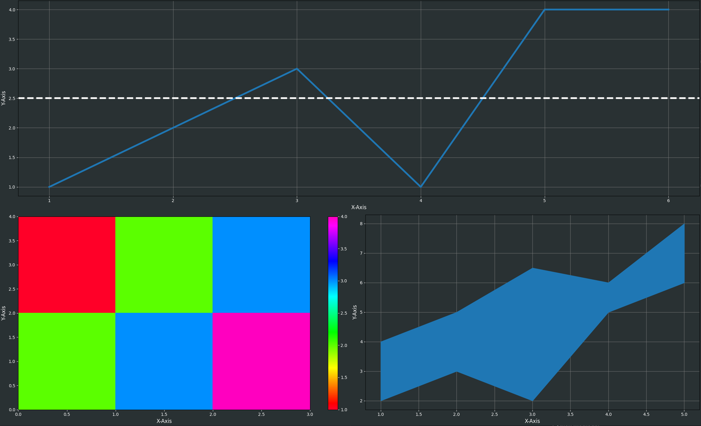

# Home

This project is about creating an easy to use interface to use matplotlib plots inside QML with the QML-like syntax.

This is an example for a dashboard build with the matplotlib bridge, PySide2 and QML:



This is the result of the following code:

```qml
ColumnLayout {
    anchors.fill: parent
    Figure {
        id: figure
        objectName: "figure"
        Layout.fillWidth: true
        Layout.fillHeight: true
        Component.onCompleted: init()
        faceColor: "#293133"
        Plot {
            objectName: "plot"
            faceColor: "#293133"
            Axes {
                id: ax
                objectName: "axis"
                grid: true
                gridAlpha: 0.7
                xAxisLabel: "X-Axis"
                yAxisLabel: "Y-Axis"
                xAxisTickColor: "white"
                xAxisLabelColor: "white"
                yAxisTickColor: "white"
                yAxisLabelColor: "white"

                Line {
                    id: line
                    linewidth: 4
                    xData: [1, 2, 3, 4, 5, 6]
                    yData: [1, 2, 3, 1, 4, 4]
                }
                HLine {
                    linewidth: 4
                    linestyle: "dashed"
                    color: "white"
                    y: 2.5
                }
            }
        }
    }
    RowLayout {
        Figure {
            objectName: "figure"
            Layout.fillWidth: true
            Layout.fillHeight: true
            Component.onCompleted: init()
            faceColor: "#293133"
            Plot {
                objectName: "plot"
                faceColor: "#293133"
                Axes {
                    objectName: "axis"
                    grid: false
                    gridAlpha: 0.7
                    xAxisLabel: "X-Axis"
                    yAxisLabel: "Y-Axis"
                    xAxisTickColor: "white"
                    xAxisLabelColor: "white"
                    yAxisTickColor: "white"
                    yAxisLabelColor: "white"

                    Imshow {
                    x: [[1,2,3], [2,3,4]]
                    cMap: "gist_rainbow"
                    aspect: "auto"
                    extent: [0, 3, 0, 4]
                    colorbar: Colorbar {
                        tickColor: "white"
                        tickLabelColor: "white"
                        }                       
                    }	
                }
            }
        }
        Figure {
            objectName: "figure"
            Layout.fillWidth: true
            Layout.fillHeight: true
            Component.onCompleted: init()
            faceColor: "#293133"
            Plot {
                objectName: "plot"
                faceColor: "#293133"
                Axes {
                    objectName: "axis"
                    grid: true
                    gridAlpha: 0.7
                    xAxisLabel: "X-Axis"
                    yAxisLabel: "Y-Axis"
                    xAxisTickColor: "white"
                    xAxisLabelColor: "white"
                    yAxisTickColor: "white"
                    yAxisLabelColor: "white"

                    FillBetween {
                        id: fb
                        x: [1,2,3,4,5]
                        y1: [2,3,2,5,6]
                        y2: [4,5,6.5,6,8]
                        linewidth: 1
                    }
                }
            }
        }
    }	
}
```